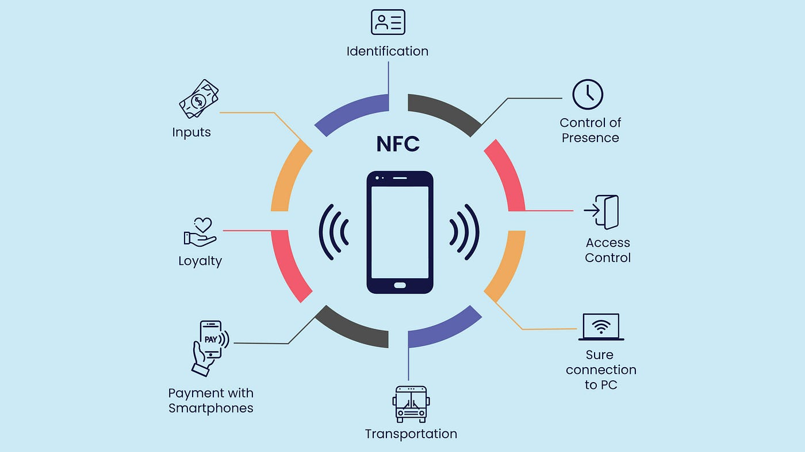
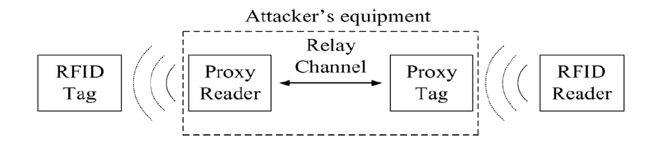
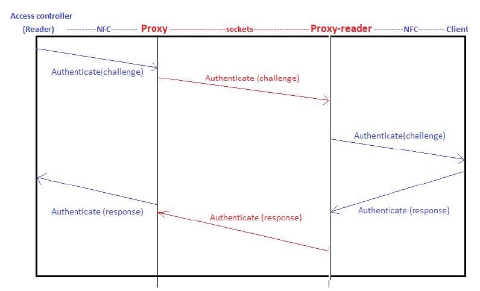
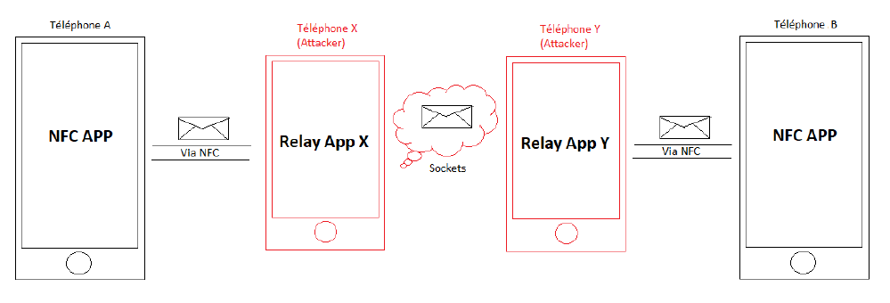

# Implementation of a Relay Attack on an NFC Authentication System

## Description
This project explores the implementation of a relay attack on Near Field Communication (NFC) authentication systems. Our objective is to analyze the vulnerabilities in NFC technology and demonstrate how an attacker can exploit these weaknesses to gain unauthorized access.

## What is NFC?
NFC (Near Field Communication) is a technology that enables the exchange of data between devices over short distances (typically 1.5 cm to 12 cm) using electromagnetic fields. It is widely used in mobile payments, access control, and data sharing.

## What is NFC-Based Authentication?
NFC-based authentication utilizes the NFC technology to allow secure communication between a mobile device and a reader. This method is often employed in various applications, including electronic passports, bank cards, and secure access systems.

Source: Medium

## What is a Relay Attack?
A relay attack is a type of security attack where an attacker intercepts and relays communication between a legitimate user and a target system. This allows the attacker to gain unauthorized access by pretending to be the legitimate user.

## Our Objective
The primary goal of this project is to conduct a detailed analysis of NFC security and to implement a relay attack on an NFC-based authentication system. We aim to demonstrate the potential risks associated with NFC technology and raise awareness about its vulnerabilities.

## Our Approach
1. **Research and Analysis**: Conduct a thorough analysis of existing literature on NFC technology, its applications, and known vulnerabilities.
2. **Implementation**: Develop a prototype to demonstrate the relay attack using compatible NFC devices.
3. **Testing and Validation**: Test the attack under various scenarios to evaluate its effectiveness and identify potential countermeasures.

## Implementation Details
We implemented the relay attack using two devices acting as a proxy for the NFC reader and tag.

As shown above, the attacker uses two devices: a proxy tag and a proxy reader. The goal is to intercept and relay the communication between a legitimate NFC reader and a valid NFC tag (like a card or smartphone).

- Proxy Tag: This device is placed near the legitimate NFC tag. When the legitimate reader sends a challenge (a request for authentication), the proxy tag captures this challenge.

- Proxy Reader: This device is positioned close to the legitimate NFC reader. It receives the challenge from the proxy tag and forwards it to the legitimate tag.

**Challenge and Response:**

The legitimate tag processes the challenge from the proxy reader and generates a response (often based on a secret or cryptographic method).
The response is sent back to the proxy reader via the proxy tag.

**Interception:**

The proxy reader captures this response and relays it to the legitimate NFC reader. The reader, believing it is communicating with the genuine tag, accepts the response and grants access.

The following steps will be taken:

1. **Setup the Proxy Devices**: Configuring one device as a reader and another as a tag.
2. **Communication Relay**: Establishing a communication channel between the two devices to relay information back and forth. Here we have used socket (TCP and UDP).

3. **Execution of the Attack**: Executing the relay attack to gain unauthorized access to the target NFC authentication system.

